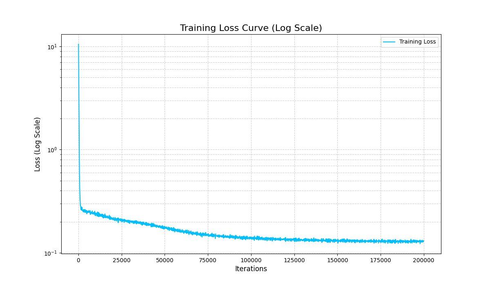
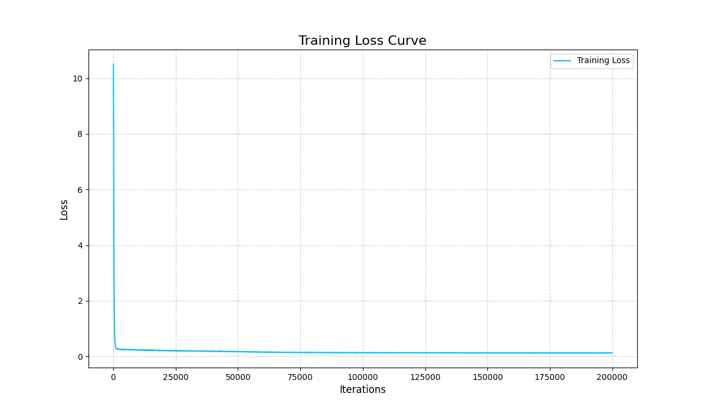
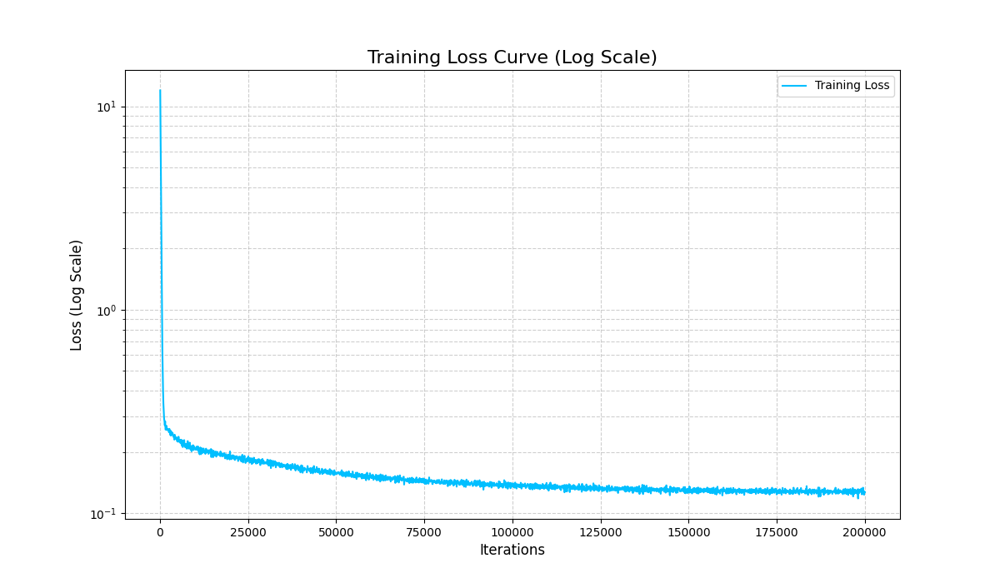

#ladder

```bash
export http_proxy=http://127.0.0.1:7890
export https_proxy=http://127.0.0.1:7890
export {HTTP,HTTPS,FTP,RSYNC}_PROXY=$http_proxy

unset {http,https,ftp,rsync}_proxy
unset {HTTP,HTTPS,FTP,RSYNC}_PROXY
```

#官方教程

`https://circuitnet.github.io/get-started.html`

#官方代码

`https://github.com/circuitnet/CircuitNet.git`

#测试说明

```bash
git clone https://github.com/heiheiha798/CircuitNet.git
```

下面会备注出每阶段使用的是哪个commit，有些代码修改后只服务于之后的任务，和之前任务冲突。可以使用

```bash
git checkout xxxxxxxx
```

来切换代码版本。一开始的三个部分都是`git checkout dc9d38c`。

**注**：github仓库的代码可以看，但是不能用我给的命令直接跑测试（因为命令都是绝对路径），并且训练完全不能跑，因为数据集太大了，没放上去（虽然处理后的npy很小，但我懒）。

## 准备

```bash
conda create -n final python=3.9
conda activate final

#这里不用codebase的1.11版torch，有点太老了
pip install torch torchvision torchaudio
pip install -r requirements.txt
```

## 数据集下载与数据预处理

使用我的百度网盘SVIP下载CircuitNet-N28数据集以及预训练权重，选取PDF中提到的五个文件夹另创建一个文件夹`dataset`存放。下载Codebase，另建repo存放代码方便更新（https://github.com/heiheiha798/CircuitNet.git）。

修改`generate_training_set.py`（如果没修改文件结构就不用改），处理数据集（注意检查数据集完整性）

```bash
python generate_training_set.py --task congestion --data_path /data/home/tianjianyang/CircuitNet/dataset --save_path /data/home/tianjianyang/CircuitNet/data
```

会在指定位置生成feature和label的npy文件。

## 定义模型与加载预训练权重

### 模型结构：

<p align="center">
  
</p>

### 为什么可以使用：

U-Net 之所以强大，是因为它通过跳跃连接，巧妙地将“是什么”（What，语义信息）和“在哪里”（Where，位置信息）结合了起来。这使得它能够在最终输出的分割图上，既能准确识别出不同类别，又能极其精细地描绘出它们之间的边界。具体结构：

编码器：它的作用和普通的图像分类网络很像。通过一系列的卷积和池化（下采样）操作，它会逐渐缩小图像的空间尺寸，同时加深特征的通道数。这个过程能让模型理解图像的上下文内容，即“图片里有什么东西？”。但代价是，在这个过程中，精确的位置信息会逐渐丢失。

解码器 ：它的作用正好相反。它通过一系列的上采样（在你的代码中是 `upconv`）和卷积操作，将编码器提取出的高级但低分辨率的特征图，逐渐恢复到原始输入图像的尺寸。这个过程旨在解决“东西具体在哪个像素位置？”的问题。

跳跃连接：它将编码器中、下采样之前的高分辨率特征图，直接“复制并拼接”到解码器对应层级的、上采样之后的特征图上。它允许解码器在进行上采样和定位时，不仅能利用来自网络底部的高级语义信息（知道这是个什么物体），还能直接获取来自编码器早期阶段的低级、高分辨率的细节信息（知道这个物体的精确边缘在哪里）。

### 加载与训练权重：

修改`CircuitNet/routability_ir_drop_prediction/utils/configs.py`中的`dataroot`

```bash
python test.py --task congestion_gpdl --pretrained /data/home/tianjianyang/CircuitNet/pretrained_weights/congestion.pth
```

测试结果

```bash
100%|████████████████████████████████████████████████| 3164/3164 [39:34<00:00,  1.33it/s]
===> Avg. NRMS: 0.0417
===> Avg. SSIM: 0.8078
===> Avg. EMD: 0.0026
```

NRMSE(Normalized root-mean-square error)：归一化均方根误差，是将均方根误差（RMSE）进行归一化处理后的统计数值。它的主要作用是使得不同量级的数据集之间的误差可以进行比较。公式如下：

$$
RMSE = \sqrt{\frac{1}{n}\sum_{i=1}^{n}(y_i - \hat{y}_i)^2}
$$

其中， $y_i$ 是真实值， $\hat{y}_i$ 是预测值， $n$ 是数据点的数量。

由于RMSE的数值会受到数据本身量级的影响，为了解决这个问题，NRMSE将RMSE除以一个归一化因子，使得结果通常在0到1之间，或者表示为百分比。在`metrics.py`中定义为除以真实值的范围（极差）：

$$
NRMSE = \frac{RMSE}{y_{max} - y_{min}}
$$

其中， $y_{max}$ 和 $y_{min}$ 分别是真实值的最大值和最小值。NRMSE的值越小，表示模型的预测效果越好。

SSIM(Structural Similarity Index Measure)：一种衡量两张图片相似度的指标。它不只比较像素的绝对差异，而是模仿人类视觉系统，通过比较图像的三个核心特征来实现：亮度：图像的明暗程度；对比度：图像的明暗反差；结构：图像的纹理和模式。最终 SSIM 的得分越接近 1，代表两张图片在人眼看来就越相似。

$$
SSIM(x, y) = \frac{(2\mu_x\mu_y + C_1)(2\sigma_{xy} + C_2)}{(\mu_x^2 + \mu_y^2 + C_1)(\sigma_x^2 + \sigma_y^2 + C_2)}
$$

其中， $\mu$ 代表均值（亮度）， $\sigma^2$ 代表方差（对比度）， $\sigma_{xy}$ 代表协方差（结构）。

代码在一个滑动的高斯窗口 (`window`)内计算每个像素的局部统计量，然后求平均作为整张图片的最终得分。

## 定义模型与训练测试

**注**：这里开始切换`git checkout 0c98884`

修改`train.py`保存loss到文件中，训练用参数为：`max_iters=100000`、`batch_size=16`、`lr=2e-4`。

运行训练（使用tmux）

```bash
tmux new -s my_training_session
CUDA_VISIBLE_DEVICES=7 python train.py --task congestion_gpdl --save_path ./checkpoints/gpdl_run1
tmux attach -t my_training_session
```

训练20w步，Loss基本锁在0.13。Training-loss随训练迭代次数的变化曲线：

<p align="center">
  
</p>

<p align="center">
  
</p>

可以看到前几个迭代次数迅速降低了training-loss，从对数图可以看到一直到10万步都有很好的对数下降，但是10万步之后就几乎没什么变化，如同之前说的，基本锁在0.13。

数据量对模型效果，不妨对不同checkpoint进行测试

```bash
python test.py --task congestion_gpdl --pretrained ./checkpoints/gpdl_run3/model_iters_10000.pth
===> Avg. NRMS: 0.0455
===> Avg. SSIM: 0.7873

python test.py --task congestion_gpdl --pretrained ./checkpoints/gpdl_run3/model_iters_50000.pth
===> Avg. NRMS: 0.0470
===> Avg. SSIM: 0.7874

python test.py --task congestion_gpdl --pretrained ./checkpoints/gpdl_run3/model_iters_200000.pth
===> Avg. NRMS: 0.0497
===> Avg. SSIM: 0.7763
```

可以看到训练量多了之后反而效果不好，因为过拟合，所以实际上训1万步就已经很好了。

## 对训练后的模型进行量化

**注**：这里切换`git checkout ff48167`

### 模型权重量化（INT4、INT8、FP4、FP8）

修改`test.py`和`configs.py`，运行测试命令

```bash
#INT8
python test.py --task congestion_gpdl \
               --pretrained ./checkpoints/gpdl_run3/model_iters_10000.pth \
               --precision INT8
===> Avg. NRMS: 0.0454
===> Avg. SSIM: 0.7875

#INT4
python test.py --task congestion_gpdl \
               --pretrained ./checkpoints/gpdl_run3/model_iters_10000.pth \
               --precision INT4
===> Avg. NRMS: 0.0469
===> Avg. SSIM: 0.7622

#FP8
python test.py --task congestion_gpdl \
               --pretrained ./checkpoints/gpdl_run3/model_iters_10000.pth \
               --precision FP8
===> Avg. NRMS: 0.0463
===> Avg. SSIM: 0.7768

#FP4
python test.py --task congestion_gpdl \
               --pretrained ./checkpoints/gpdl_run3/model_iters_10000.pth \
               --precision FP4
===> Avg. NRMS: 0.0479
===> Avg. SSIM: 0.6992
```

回顾一下之前FP32的测试结果

```bash
===> Avg. NRMS: 0.0455
===> Avg. SSIM: 0.7873
```

可以看到INT8和FP32相差无几，FP8$\gt$INT4$\gt$FP4，说明模型对INT8量化具有较强的鲁棒性。并且在相同比特宽度下，整数类型比浮点类型更适合该模型—— INT8 的表现明显优于 FP8、INT4 的表现也显著优于 FP4。这背后可能的原因是：整数类型将数值范围均匀地切分成N个等级，而浮点类型（特别是低比特）的表示是非均匀的（在0附近精度高，离0越远越稀疏）。结果表明，模型权重中的大小信息同样重要，均匀的量化方式更好地保留了模型的原始信息。同时不难看出：精度越低，性能下降越明显。这是一个符合预期的趋势。从FP32到8-bit，再到4-bit，模型的性能逐步下降。特别是FP4，其SSIM从0.7873骤降至0.6992，说明4个比特的浮点数完全不足以表达模型权重的有效信息，导致了严重的精度损失。

**注**：这里切换`git checkout d13a0c0`

### 模型的不同组成模块量化与激活值量化

修改`test.py`和`configs.py`，运行测试命令

```bash
# 只量化 encoder 模块的权重为 INT4
python test.py --task congestion_gpdl \
               --pretrained ./checkpoints/gpdl_run3/model_iters_10000.pth \
               --precision INT4 \
               --quant_target weights \
               --quant_module encoder
===> Avg. NRMS: 0.0460
===> Avg. SSIM: 0.7840

# 只量化 decoder 模块的权重为 INT4
python test.py --task congestion_gpdl \
               --pretrained ./checkpoints/gpdl_run3/model_iters_10000.pth \
               --precision INT4 \
               --quant_target weights \
               --quant_module decoder
===> Avg. NRMS: 0.0463
===> Avg. SSIM: 0.7659

# 只量化激活值 
python test.py --task congestion_gpdl \
               --pretrained ./checkpoints/gpdl_run3/model_iters_10000.pth \
               --precision INT4 \
               --quant_target activations \
               --quant_module all
===> Avg. NRMS: 0.2338
===> Avg. SSIM: 0.2099
```

回顾之前模型权重INT4量化以及不量化

```bash
#INT4
===> Avg. NRMS: 0.0469
===> Avg. SSIM: 0.7622

#FP32
===> Avg. NRMS: 0.0455
===> Avg. SSIM: 0.7873
```

可以得出结论：

解码器（Decoder）比编码器（Encoder）对权重INT4量化更敏感。

- 只量化`encoder`时，性能下降极小 (SSIM: 0.7873 $\longrightarrow$ 0.7840)，几乎可以忽略不计。
- 而只量化`decoder`时，性能下降则更为明显 (SSIM: 0.7873 $\longrightarrow$ 0.7659)，这说明模型在进行特征重建和上采样时，对权重的精度要求更高。

模型对激活值（Activations）的量化极其敏感，INT4激活值量化是不可接受的。

- 这是最显著的发现。只对激活值进行INT4量化，导致了模型性能的灾难性崩溃（NRMS从0.046飙升至0.2338，SSIM从0.78骤降至0.2099）。这表明，模型在前向传播过程中产生的中间特征图，其数值范围和精度要求远超INT4所能表达的16个离散等级，巨大的信息损失导致模型几乎失效。相比之下模型权重的量化完全可以接受。

### 选做：尝试在训练过程中对模型进行量化

选做=不做

## 参考论文，改进模型

**注**：这里切换`git checkout 8c2b4a1`

### 融合Squeeze-and-Excitation (SE)注意力机制

**目标**: 让网络显式地建模通道间的相互依赖关系，通过学习的方式自动获取每个特征通道的重要程度，然后根据这个重要程度去增强有用的特征并抑制对当前任务用处不大的特征。

**具体修改**:

1.  创建了一个新的 `SEBlock` 模块。该模块包含一个全局平均池化层（Squeeze），两个全连接层和一个Sigmoid激活函数（Excitation），用于生成各通道的权重。
2.  修改了原有的 `conv` 模块。在两个`卷积-归一化-激活`单元之后，加入了一个`SEBlock`。这样，每个基础卷积块的输出都会经过通道注意力重新校准，然后再传递给下一层。

### 在网络瓶颈处加入ASPP模块

**目标**: ASPP通过使用不同扩张率（dilation rate）的空洞卷积，能够在不增加参数量和计算量的前提下，以多个尺度捕捉图像的上下文信息，这对于处理不同大小的目标分割任务尤其有效 。

**具体修改**:

1.  创建了一个新的 `ASPP` 模块。它包含一个1x1卷积、三个不同扩张率的3x3空洞卷积以及一个全局平均池化分支。
2.  将这个 `ASPP` 模块插入到 `Encoder` 和 `Decoder` 之间。`Encoder` 的输出不再直接送入 `Decoder`，而是先经过 `ASPP` 模块进行多尺度特征融合，然后将融合后的特征送入 `Decoder`。

### 代码修改具体解释

1. `SEBlock` 类: 新加入，用于实现通道注意力。
2. `conv` 类:
   - 在其 `__init__` 方法中增加了 `use_se=True` 参数，默认为`True`，表示默认使用SE模块。
   - 在 `forward` 方法中，如果 `use_se` 为真，则在主卷积操作后应用SE模块。
3. `Encoder` 类:
   - `__init__` 的参数做了调整，可以更灵活地控制各阶段的通道数，例如 `c1_channels`, `c2_channels`, `bottleneck_channels`。
   - `forward` 方法返回瓶颈层输出 `h5_bottleneck` 和用于跳跃连接的 `h2_for_skip` (即原始代码中的`h2`)。`skip_channels_h2` 属性储存了 `h2_for_skip` 的通道数，方便Decoder使用。
4. `ASPPConv`, `ASPPPooling`, `ASPP` 类: 新加入，用于实现ASPP模块。
   - `ASPP` 模块接收 `Encoder` 瓶颈层的输出，通过多个并行的不同空洞率的卷积和全局池化来捕捉多尺度信息。
   - `branch_channels` 的计算逻辑做了调整，使其更适应不同的输入通道数。
   - `ASPP` 的最终输出通道数由 `out_channels` 参数控制。
5. `Decoder` 类:
   - `__init__` 的参数调整为 `main_input_channels` (来自ASPP的输出) 和 `skip_input_channels` (来自Encoder的跳跃连接)。
   - `forward` 方法接收 `main_feature` (来自ASPP) 和 `skip_feature` (来自Encoder)。
   - 内部的 `conv` 块现在可以根据 `use_se_in_conv` 参数决定是否使用SE模块。
   - **跳跃连接逻辑对齐**：确保了 `torch.cat` 操作是针对 `upc1` 的输出 (`d2_upsampled`) 和 `Encoder` 传来的 `skip_feature` (`h2_for_skip`)，并且后续的 `conv2` 能够正确处理拼接后的通道数。
6. `GPDL` 类 (主模型):
   - 在其 `__init__` 方法中，按顺序实例化了 `Encoder`, `ASPP`, `Decoder`。
   - 添加了新的参数来控制内部模块的通道数和是否使用SE，例如 `enc_c1_channels`, `enc_bottleneck_channels`, `aspp_out_channels`, `use_se_in_conv`。
   - `forward` 方法清晰地定义了数据流：`Encoder -> ASPP -> Decoder`，并将 `Encoder` 的跳跃连接正确传递给 `Decoder`。
   - `init_weights` 方法保持不变。

### 训练

```bash
tmux new -s my_training_session
CUDA_VISIBLE_DEVICES=4 python train.py --task congestion_gpdl --save_path ./checkpoints/enhanced_gpdl_run1
tmux attach -t my_training_session
```

<div style="display: flex; justify-content: center; align-items: center;">   
    
</div>

### 测试

```bash
python test.py --task congestion_gpdl --pretrained ./checkpoints/enhanced_gpdl_run1/model_iters_10000.pth
===> Avg. NRMS: 0.0460
===> Avg. SSIM: 0.7905

python test.py --task congestion_gpdl --pretrained ./checkpoints/enhanced_gpdl_run1/model_iters_50000.pth
===> Avg. NRMS: 0.0494
===> Avg. SSIM: 0.7846

python test.py --task congestion_gpdl --pretrained ./checkpoints/enhanced_gpdl_run1/model_iters_200000.pth
===> Avg. NRMS: 0.0491
===> Avg. SSIM: 0.7880
```

可以看到最好的还是1万步，同时回顾一下之前模型的最好表现

```bash
===> Avg. NRMS: 0.0455
===> Avg. SSIM: 0.7873
```

不难看出修改后的模型SSIM表现略微提升，但提升有限，可能该领域的维度较少，一开始的模型学习能力已经足够强。同时结合codebase给出的预训练模型，可以推测最好的表现应该趋近于`NRMS: 0.0417`、`SSIM: 0.8078`。
